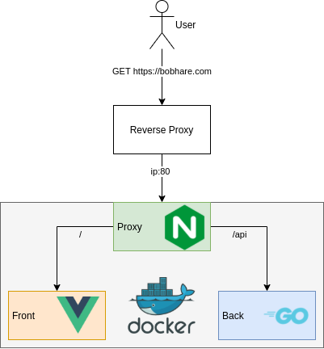

# Bobhare

## Gestionnaire de sites favoris 

## Fonctionnalités

- pouvoir catégoriser
- système récupération favicon du site ou pouvoir customiser
- authentification avec WebAuth (tu mets ta clé, il te recoco)
- gestion de groupe (au sens individu)

## Définitions 

Groupe : 
- Un Owner (tous les droits)
- un gestionnaire (accès lecture/écriture par catégorie)
- troufion (juste accès en lecture).

## Architecture

